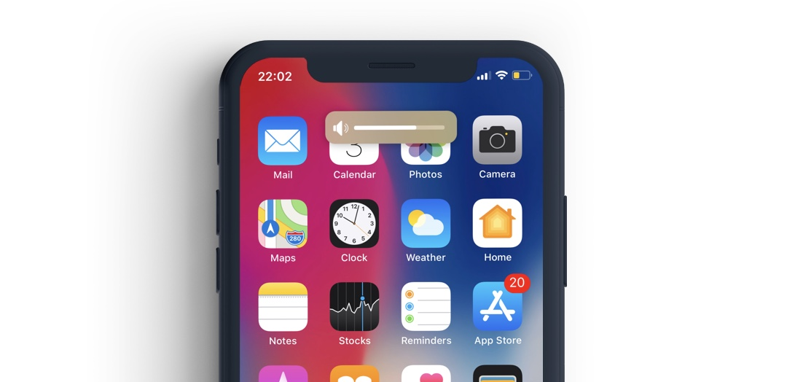

# Pikabu - Volume Hud tweak for jailbroken iOS devices

Pikabu is a project that I developed over 5 years ago. It was a project for me to learn about code injection and running unsigned binary executables.

The project is developed with [thoes](https://theos.dev/), a cross-platform suite of tools for building and deploying software for iOS and other platforms.